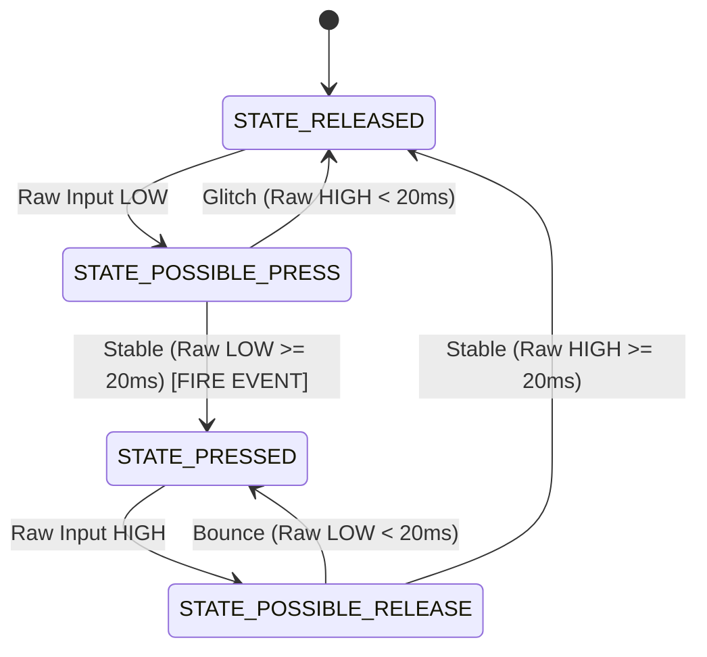

# Practice PR-03: GPIO Mechanical Switch Debouncing

---

## 1. Identification

* **Practice ID:** `PR-03`
* **Practice Title:** GPIO Mechanical Switch Debouncing
* **Module:** `M03` — General Purpose Input/Output (GPIO) & Software Debouncing
* **Estimated Duration:** 3.0 Hours (1.0h Theory / 2.0h Laboratorio)
* **Associated SLO:** `SLO-02` (Read digital input states using `PINx` registers with internal pull-up resistors enabled and implement software anti-rebote algorithms)
* **Scaffolding Level:** `Level A — Guided`
* **Difficulty:** Introductory / Intermediate

---

## 2. Learning Objectives

By completing this laboratory practice, the student will be able to:
1. Explain the physical phenomenon of mechanical switch contact bounce and its impact on digital state machines and event counters.
2. Compare blocking (`_delay_ms()`) versus non-blocking (Finite State Machine) debouncing strategies in embedded firmware.
3. Implement a deterministic non-blocking button state machine in bare-metal C that filters switch contact noise and generates single-event triggers per button press.
4. Evaluate memory footprint and assembly instructions generated for state machine variables and I/O bit operations.

---

## 3. Technical Prerequisites

* **Prerequisite Practices:** `PR-01` (GPIO Output) and `PR-02` (GPIO Input & Internal Pull-Up).
* **Required Knowledge:** Active-low logic, internal pull-up resistors, finite state machine concepts (`enum`, `static` variables), and bitwise masking.

---

## 4. Required Hardware

### Components per Student / Team
| Component / Part | Quantity | Description / Specification |
| :--- | :---: | :--- |
| Microcontroller | 1x | ATmega328P-PU (DIP-28 package) |
| Breadboard | 1x | Standard 830-point solderless breadboard |
| Push Button | 1x | 4-Pin Tactile Push Button |
| LED | 1x | 5mm Standard Red LED |
| Resistor | 1x | 330 Ω 1/4W Carbon Film Resistor (LED Limiter) |
| Power Supply | 1x | 5V DC regulated breadboard power supply |
| ISP Programmer | 1x | USBasp ISP programmer with cable (when available) |
| Jumper Wires | Kit | Male-to-Male breadboard jumper wires |

### Shared Laboratory Equipment
* 8-Channel USB Logic Analyzer (24 MHz) or Digital Oscilloscope (Recommended for capturing mechanical contact bounce waveforms).

---

## 5. Required Software & Toolchain

* **Editor:** VS Code with C/C++ Extension Pack
* **Compiler:** `avr-gcc` (Microchip AVR GNU Toolchain 15.1.0 / GCC 15+ compatible)
* **Build System:** GNU Make 4.4.1
* **Flasher:** AVRDUDE 8.2 (Windows x64)
* **Framework Policy:** **Strictly Bare-Metal C** (No Arduino IDE, Wiring libraries, `digitalRead`, or Arduino helper libraries allowed).

---

## 6. Datasheet References (Microchip ATmega328P)

Students must consult the official ATmega328P datasheet (DS40002061) for the following sections:

| Peripheral / Topic | Datasheet Section | Relevant Registers | Key Bits / Flags |
| :--- | :--- | :--- | :--- |
| I/O Port Properties | Section 14.1: Overview | `DDRD`, `PORTD`, `PIND` | Digital I/O Reading |
| Register Description | Section 14.4: Register Description | `DDRD` (0x0A), `PORTD` (0x0B), `PIND` (0x09) | `DDD2` (Bit 2), `PORTD2` (Bit 2), `PIND2` (Bit 2) |

> **Datasheet Navigation Task:**  
> Open Section 14.1 and Section 14.4 of the ATmega328P datasheet:
> 1. Verify why reading `PIND` returns the actual electrical logic level present at physical pin `PD2` regardless of whether contact bounce is occurring.
> 2. Explain why the ATmega328P digital input synchronizer (Schmitt trigger + 0.5 to 1.5 clock cycle latch) does NOT eliminate mechanical switch bounce.

---

## 7. Engineering Problem Statement

Mechanical switches contain metallic contacts that physically bounce against each other for 1 ms to 20 ms when pressed or released. To a high-speed CPU executing millions of instructions per second, a single physical button press appears as dozens of rapid HIGH/LOW voltage transitions.

In an industrial counter or user interface, un-debounced button signals cause false multi-triggering. The goal of this practice is to design a software debouncing algorithm that filters contact bounce, registers exactly **one toggle event per button press**, and operates in a **non-blocking** manner to keep the CPU available for concurrent tasks.

---

## 8. Blocking vs. Non-Blocking Debounce Comparison

| Criterion | Blocking Debounce (`_delay_ms`) | Non-Blocking FSM Debounce |
| :--- | :--- | :--- |
| **Simplicity** | High (Simple `if` statement) | Moderate (Requires State Machine) |
| **CPU Availability** | **Zero** (CPU frozen in delay loop) | **100%** (CPU available between 1ms ticks) |
| **Scalability** | Poor (Cannot handle multiple buttons/tasks) | Excellent (Extends to super-loop / task schedulers) |
| **Event Detection** | Level-sensitive | Edge-triggered event generation |
| **Engineering Recommendation** | Introductory / Demonstration only | **Recommended for production firmware** |

---

## 9. Register Map

| Register | Address | Bits Used | Function in This Practice |
| :--- | :---: | :--- | :--- |
| `DDRD` | `0x0A` (`0x2A` I/O) | Bit 2 (`DDD2`) | Configures pin PD2 as Input (`0`). |
| `PORTD` | `0x0B` (`0x2B` I/O) | Bit 2 (`PORTD2`) | Enables internal pull-up resistor on PD2 (`1`). |
| `PIND` | `0x09` (`0x29` I/O) | Bit 2 (`PIND2`) | Reads physical logic level of pin PD2 (`0` = pressed to GND). |
| `DDRB` | `0x04` (`0x24` I/O) | Bit 5 (`DDB5`) | Configures pin PB5 as Output (`1`). |
| `PORTB` | `0x05` (`0x25` I/O) | Bit 5 (`PORTB5`) | Toggles status LED on confirmed press event (`^= (1 << PORTB5)`). |

---

## 10. Circuit Schematic & Wiring Table

| ATmega328P Pin | Physical Pin (DIP-28) | External Component | Connection Details |
| :--- | :---: | :--- | :--- |
| `PD2` | Pin 4 | Tactile Push Button Terminal 1 | Connected directly to PD2 |
| `GND` | Pin 8 / Pin 22 | Tactile Push Button Terminal 2 | Connected to Common Power Ground (0V) |
| `PB5` | Pin 19 | LED Anode (+) | Connected via 330 Ω series resistor |
| `GND` | Pin 8 / Pin 22 | LED Cathode (-) | Connected to Common Power Ground (0V) |
| `VCC` | Pin 7 / Pin 20 | Power Supply +5V | Connected to Regulated +5V DC Supply |
| `RESET` | Pin 1 | Pull-up Resistor | 10 kΩ connected to +5V DC |

---

## 11. Firmware Design & Algorithm

### Non-Blocking State Machine States
* **`STATE_RELEASED`:** Button is unpressed (PD2 = HIGH). Waiting for initial LOW transition.
* **`STATE_POSSIBLE_PRESS`:** Initial LOW transition detected. Timer counting consecutive LOW samples.
* **`STATE_PRESSED`:** Stable LOW state confirmed after 20 ms. Event trigger fired ONCE.
* **`STATE_POSSIBLE_RELEASE`:** Initial HIGH transition detected. Timer counting consecutive HIGH samples.



---

## 12. Implementation Code

Reference source code located at `firmware/examples/03_gpio_debounce/main.c`:

```c
#include <avr/io.h>
#include <util/delay.h>
#include <stdint.h>
#include <stdbool.h>

#define DEBOUNCE_MS 20

typedef enum {
    STATE_RELEASED,
    STATE_POSSIBLE_PRESS,
    STATE_PRESSED,
    STATE_POSSIBLE_RELEASE
} button_state_t;

static bool process_button_debounce(void) {
    static button_state_t current_state = STATE_RELEASED;
    static uint8_t timer_ms = 0;
    bool event_trigger = false;

    bool raw_pressed = !(PIND & (1 << PIND2));

    switch (current_state) {
        case STATE_RELEASED:
            if (raw_pressed) {
                current_state = STATE_POSSIBLE_PRESS;
                timer_ms = 0;
            }
            break;

        case STATE_POSSIBLE_PRESS:
            if (raw_pressed) {
                timer_ms++;
                if (timer_ms >= DEBOUNCE_MS) {
                    current_state = STATE_PRESSED;
                    event_trigger = true;
                }
            } else {
                current_state = STATE_RELEASED;
            }
            break;

        case STATE_PRESSED:
            if (!raw_pressed) {
                current_state = STATE_POSSIBLE_RELEASE;
                timer_ms = 0;
            }
            break;

        case STATE_POSSIBLE_RELEASE:
            if (!raw_pressed) {
                timer_ms++;
                if (timer_ms >= DEBOUNCE_MS) {
                    current_state = STATE_RELEASED;
                }
            } else {
                current_state = STATE_PRESSED;
            }
            break;
    }

    return event_trigger;
}

int main(void) {
    DDRD &= ~(1 << DDD2);
    PORTD |= (1 << PORTD2);
    DDRB |= (1 << DDB5);

    while (1) {
        if (process_button_debounce()) {
            PORTB ^= (1 << PORTB5);
        }
        _delay_ms(1);
    }

    return 0;
}
```

---

## 13. Build Procedure

Compile the project from the repository root directory using PowerShell:

```powershell
# 1. Clean previous build artifacts
make EXAMPLE_DIR=firmware/examples/03_gpio_debounce clean

# 2. Compile firmware and generate ELF, HEX, MAP, and LSS
make EXAMPLE_DIR=firmware/examples/03_gpio_debounce all

# 3. Report Flash and SRAM memory consumption
make EXAMPLE_DIR=firmware/examples/03_gpio_debounce size

# 4. Generate disassembly file for assembly analysis
make EXAMPLE_DIR=firmware/examples/03_gpio_debounce disasm
```

---

## 14. Programming Procedure (ISP Flashing)

> **Hardware Programming Status:** Physical hardware flashing is currently **PENDING** until the USBasp programmer is attached to the host USB port. Once connected, execute:

```powershell
make EXAMPLE_DIR=firmware/examples/03_gpio_debounce flash
```

---

## 15. Verification Procedure

### A. Software Verification (Offline)
1. Verify that `make` completes with return code `0` and zero compiler warnings.
2. Confirm `firmware/examples/03_gpio_debounce/build/main.hex` is generated.
3. Check `make size` output: Flash text footprint is ~316 bytes, SRAM usage is 3 bytes (static variables).
4. Inspect `build/main.lss` to verify static variable allocations in `.bss` section.

### B. Physical Verification (With Hardware Connected)
1. Press tactile button rapidly 10 times.
2. Verify that the LED toggles state **exactly 10 times**, with zero false extra toggles.
3. Connect a USB Logic Analyzer to PD2 and PB5 to measure switch bounce duration and confirm LED toggle fires 20 ms after initial switch contact.

---

## 16. Expected Observations & Experimental Measurement

| Parameter / Signal | Theoretical Calculated Value | Measured Value | Tolerance / Error |
| :--- | :---: | :---: | :---: |
| Flash Memory Usage | 316 Bytes | 316 Bytes | 0 Bytes |
| SRAM Usage (`.bss`) | 3 Bytes | 3 Bytes | 0 Bytes |
| Debounce Delay Threshold | 20 ms | 20 ms | $\pm 1\text{ms}$ |
| Extra False Toggles per Press | 0 | 0 | 0 |

---

## 17. Technical Engineering Analysis

Answer the following engineering questions in your lab report:
1. Why is mechanical contact bounce considered a physical hardware phenomenon rather than a software bug?
2. What is the fundamental disadvantage of using `_delay_ms(50)` inside an event loop for debouncing in multi-tasking systems?
3. Explain the purpose of declaring `current_state` and `timer_ms` as `static` variables inside `process_button_debounce()`.
4. What happens if `DEBOUNCE_MS` is set too low (e.g., 1 ms)? What happens if set too high (e.g., 500 ms)?
5. Why must the state machine require a stable release phase (`STATE_POSSIBLE_RELEASE`) in addition to a stable press phase?
6. How does generating an edge-triggered event (`event_trigger = true`) differ from continuously reading raw level input (`PIND & (1 << PIND2)`)?
7. In future modules (PR-05), how will a hardware Timer interrupt replace the `_delay_ms(1)` polling tick?
8. Why does the `.bss` section report 3 bytes of SRAM usage for this firmware?
9. Explain what would happen if a spurious 2ms voltage drop occurred due to EMI while the button was released.
10. Summarize why non-blocking state machines are essential for scaling bare-metal microcontroller applications.

---

## 18. Evidence Deliverables Package

Submit the following items:
1. Source code file (`main.c`).
2. Terminal output log of `make` and `make size`.
3. State machine state diagram and `.bss` SRAM memory usage explanation.
4. Completed answers to the **Datasheet Navigation Task** and **Technical Engineering Analysis** questions.
5. (When hardware is available) Logic analyzer waveform or video demonstrating clean 1:1 button press to LED toggle operation.

---

## 19. Evaluation Rubric (100 Points Total)

| Rubric Criterion | Description | Points |
| :--- | :--- | :---: |
| **Technical Functionality** | FSM debouncing algorithm executes cleanly with zero false triggers on button press/release. | 30 |
| **Register & State Machine Rigor** | Proper use of `PIND`, `PORTB`, `enum`, and `static` FSM variables without high-level wrappers. | 25 |
| **Code Quality & Build System** | Strict C11 formatting, zero warnings, correct Makefile execution. | 15 |
| **Engineering & Datasheet Analysis** | Accurate answers to Datasheet Navigation Task and Analysis questions. | 15 |
| **Experimental Measurement & Evidence** | Complete deliverables package including memory footprint and FSM state transition documentation. | 15 |
| **Total** | | **100** |

---

## 20. Common Failure Modes & Troubleshooting

* **LED toggles multiple times per press:** `DEBOUNCE_MS` threshold is too low or static variable `timer_ms` is being reset on every call.
* **Button unresponsive / requires long hold:** `DEBOUNCE_MS` set excessively high or `_delay_ms()` in main loop is too long.
* **State machine gets stuck in `STATE_PRESSED`:** Switch contact wiring is loose or active-low logic expression `!(PIND & (1 << PIND2))` is inverted.
* **SRAM usage unexpectedly high:** Local variables inside FSM function were not declared `static`, or global buffers were allocated unnecessarily.

---

## 21. Workspace Cleanup & Reset State

```powershell
make EXAMPLE_DIR=firmware/examples/03_gpio_debounce clean
```
Disconnect breadboard power supply after completing measurements.
